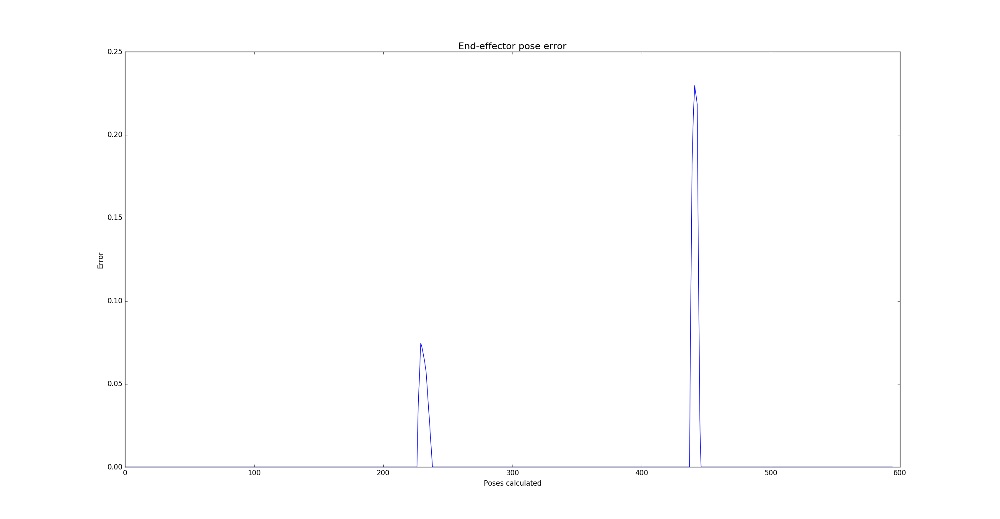

# Project: Kinematics Pick & Place
[//]: (Image References)

[image1]: ./misc_images/fk_img_1.png
[image2]: ./misc_images/fk_img_2.png
[image3]: ./misc_images/dh-parameter.jpg

## Kinematic Analysis

### 1. Run the forward_kinematics demo and evaluate the kr210.urdf.xacro file to perform kinematic analysis of Kuka KR210 robot and derive its DH parameters.

![alt text][image1]
![alt text][image2]

From the forward_kinematic demonstration, the first step was to analyze the URDF.xacro file. Once it is known that the same information in the URDF file is available in RViz in the visualization tree within the TF parent, then the distances between the unions were started from there to create the DH parameter table. The demonstration was also used to analyze the signs of the rotation of each joint.

In the following figure, the DH parameters of the robot are schematized.
![Robot schematic and DH parameters][image3]

The resulting Table:

Joint | Links | alpha(i-1) | a(i-1) | d(i)   | theta(i)
  --- | ---   | ---        | ---    | ---    | ---
1     |0->1  | 0           | 0      | 0.75   | $\theta_1$
2     |1->2  | $- \pi/2$   | 0.35   | 0      | $-\pi/2 + \theta_2$
3     |2->3  | 0           | 1.25   | 1.5    | $\theta_3$
4     |3->4  | $- \pi/2$   | -0.54  | 0      | $\theta_4$
5     |4->5  | $\pi/2$     | 0      | 0      | $\theta_5$
6     |5->6  | $- \pi/2$   | 0      | 0      | $\theta_6$
7     |6->EE | 0           | 0      | 0.303  | 0

* alpha(i-1): twist angle, angle between axis Z(i-1) and Z(i) measured about axis X(i-1)
* a(i-1): link length, distance from axis Z(i-1) to Z(i) measured along axis X(i-1)
* d(i): link offset, distance from axis X(i-1) to X(i) measured along axis Z(i)
* theta(i): joint angle, angle between axis X(i-1) and X(i) measured about axis Z(i)

As it was explained in the lessons, the only thing that need attention is the offset of Theta 2 by -90 degrees.

---

### 2. Using the DH parameter table you derived earlier, create individual transformation matrices about each joint. In addition, also generate a generalized homogeneous transform between base_link and gripper_link using only end-effector(gripper) pose.

>The code related to solve the Inverse Kinematic problem is in `FK_class.py`.

Following the modified parameters of Denavit-Hartenberg, the general form of the homogeneous transformation $_{i}T^{i-1}$ is defined as:

$_{i}T^{i-1}=Rot_x(\alpha_{(i-1)})Trl_x(a_{i-1})Rot_z(\theta_{(i)})Trl_z(d_{i})$

Resulting:

$_{i}T^{i-1}=\left[\begin{matrix}
        \cos{\left(\theta_i \right)} & - \sin{\left(\theta_i \right)} & 0 & a_{(i-1)}\\
        \sin{\left(\theta_i \right)} \cos{\left(\alpha_{(i-1)} \right)} & \cos{\left(\alpha_{(i-1)} \right)} \cos{\left(\theta_i \right)} & - \sin{\left(\alpha_{(i-1)} \right)} & - d_i \sin{\left(\alpha_{(i-1)} \right)}\\
        \sin{\left(\alpha_{(i-1)} \right)} \sin{\left(\theta_i \right)} & \sin{\left(\alpha_{(i-1)} \right)} \cos{\left(\theta_i \right)} & \cos{\left(\alpha_{(i-1)} \right)} & d_i \cos{\left(\alpha_{(i-1)} \right)}\\
        0 & 0 & 0 & 1
        \end{matrix}\right]$

From the previous definition, it is possible to obtain the transformation matrices for the board, obtained:

$_{0}T^{1}=\left[\begin{matrix}\cos{\left (\theta_{1} \right )} & - \sin{\left (\theta_{1} \right )} & 0 & 0\\\sin{\left (\theta_{1} \right )} & \cos{\left (\theta_{1} \right )} & 0 & 0\\0 & 0 & 1 & 0.75\\0 & 0 & 0 & 1\end{matrix}\right]$

$_{1}T^{2}=\left[ \begin{matrix}
\sin{\left(\theta_{2} \right)} & \cos{\left(\theta_{2} \right)} & 0 & 0.35\\
0 & 0 & 1 & 0\\
\cos{\left(\theta_{2} \right)} & - \sin{\left(\theta_{2} \right)} & 0 & 0\\
0 & 0 & 0 & 1
\end{matrix} \right]$

$_{2}T^{3}=\left[\begin{matrix}\cos{\left (\theta_{3} \right )} & - \sin{\left (\theta_{3} \right )} & 0 & 1.25\\\sin{\left (\theta_{3} \right )} & \cos{\left (\theta_{3} \right )} & 0 & 0\\0 & 0 & 1 & 0\\0 & 0 & 0 & 1\end{matrix}\right]$

$_{3}T^{4}=\left[\begin{matrix}\cos{\left (\theta_{4} \right )} & - \sin{\left (\theta_{4} \right )} & 0 & -0.054\\0 & 0 & 1 & 1.5\\- \sin{\left (\theta_{4} \right )} & - \cos{\left (\theta_{4} \right )} & 0 & 0\\0 & 0 & 0 & 1\end{matrix}\right]$

$_{4}T^{5}=\left[\begin{matrix}\cos{\left (\theta_{5} \right )} & - \sin{\left (\theta_{5} \right )} & 0 & 0\\0 & 0 & -1 & 0\\\sin{\left (\theta_{5} \right )} & \cos{\left (\theta_{5} \right )} & 0 & 0\\0 & 0 & 0 & 1\end{matrix}\right]$

$_{5}T^{6}=\left[\begin{matrix}\cos{\left (\theta_{5} \right )} & - \sin{\left (\theta_{5} \right )} & 0 & 0\\0 & 0 & -1 & 0\\\sin{\left (\theta_{5} \right )} & \cos{\left (\theta_{5} \right )} & 0 & 0\\0 & 0 & 0 & 1\end{matrix}\right]$

$_{6}T^{EE}=\left[\begin{matrix}1 & 0 & 0 & 0\\0 & 1 & 0 & 0\\0 & 0 & 1 & 0.303\\0 & 0 & 0 & 1\end{matrix}\right]$

Finally, to obtain the transformation matrix from the base link to the final effector, it is necessary to post-multiply each matrix T in the following way:

$_{0}T^{EE}=\ _{0}T^{1}\ _{1}T^{2}\ _{2}T^{3}\ _{3}T^{4}\ _{4}T^{5}\ _{5}T^{6}\ _{6}T^{EE}$

> I do not put the resulting matrix because it is a huge complex matrix, full of trigonometric operations, anything but intuitive.

---

### 3. Decouple Inverse Kinematics problem into Inverse Position Kinematics and inverse Orientation Kinematics

Solve the inverse kinematic model of an anthropomorphic robotic manipulator it is not as easy as the direct kinematic model. By definition, the dexterous workspace of a robotic manipulator is the volume of space that the robot end-effector can reach with an arbitrary orientation. That means that any point of this workspace have multiple solutions. There also are points that can be reached with different configurations of the joints with the same orientation.

One strategy to attack this problem is to divide it into two sub-problems: Inverse Position Kinematics and inverse Orientation Kinematics.

**Inverse Position Kinematics**

For solving the Position, it is needed to calculate the angles of the first three joints $\theta_1$, $\theta_2$, $\theta_3$ which define the position of the wrist center (**wc**).

The **wc** is gotten as it was explained in the Inverse Kinematics lessons, implementing the following equation:

$^{0}\mathbf{r}_{WC/0} = ^{0}\mathbf{r}_{EE/0} - d \  ^{0}\mathbf{R}_{6}\left[\begin{matrix}
0\\
0\\
1
\end{matrix}\right] = \left[\begin{matrix}
p_x\\
p_y\\
p_z
\end{matrix}\right] - d\ ^{0}\mathbf{R}_{6}\left[\begin{matrix}
0\\
0\\
1
\end{matrix}\right]$

Then, now with the **wc**, be can calculate the $\theta_1$ as follow:

$\theta_1=atan2(wc_y,wc_x)$

That give us at least two solution, the clockwise direction and the counterclockwise direction.

> Here it appears the first problem. By only know the **wc**, it is not possible to determine if the arm is working backwards, as show the columns to the picture above.

Later to calculate $\theta_2$ and $\theta_3$, we use the cosine law to solve triangle shown in the figure below.

> The direct solution of the triangle only gives us a solution, because we really do not know a priori if the elbow is in the up or down position, as shown in the first picture with the multiple solutions.

Then:

$\theta_2 = \pi/2 - a- \alpha$

$\theta_2 = \pi/2 - b- \beta$

**Inverse Orientation Kinematics**

To obtain the angles of $\theta_4$, $\theta_5$ and $\theta_6$ the procedure explained in the lesson of inverse kinematics was followed. Now that you have $\theta_1$, $\theta_2$ and $\theta_3$ you calculate the one of $_0\mathbf{T}^3$ to extract the $_0\mathbf{R}^3$, then it transposes to finally get $_3\mathbf{R}^0$. As we also know, that the rotation matrix used early to define the orientation of the final effector is equal to $_0\mathbf{R}^EE$.

Then, working with the simbolic matrices:

$_3\mathbf{R}^6 = _3\mathbf{R}^0 \ _0\mathbf{R}^6$

Resulting:

$_3\mathbf{R}^6 =\left[\begin{matrix}- s{\left (\theta_{4} \right )} s{\left (\theta_{6} \right )} + c{\left (\theta_{4} \right )} c{\left (\theta_{5} \right )} c{\left (\theta_{6} \right )} & - s{\left (\theta_{4} \right )} c{\left (\theta_{6} \right )} - s{\left (\theta_{6} \right )} c{\left (\theta_{4} \right )} c{\left (\theta_{5} \right )} & - s{\left (\theta_{5} \right )} c{\left (\theta_{4} \right )}\\s{\left (\theta_{5} \right )} c{\left (\theta_{6} \right )} & - s{\left (\theta_{5} \right )} s{\left (\theta_{6} \right )} & c{\left (\theta_{5} \right )}\\- s{\left (\theta_{4} \right )} c{\left (\theta_{5} \right )} c{\left (\theta_{6} \right )} - s{\left (\theta_{6} \right )} c{\left (\theta_{4} \right )} & s{\left (\theta_{4} \right )} s{\left (\theta_{6} \right )} c{\left (\theta_{5} \right )} - c{\left (\theta_{4} \right )} {\left (\theta_{6} \right )} & s{\left (\theta_{4} \right )} s{\left (\theta_{5} \right )}\end{matrix}\right]$

With $\mathbf{R}_{roll,pitch,yaw} = \left[\begin{matrix}r_{11}&r_{12}&r_{13}\\
r_{21}&r_{22}&r_{23}\\
r_{21}&r_{22}&r_{23}
 \end{matrix}\right]$ it can be defined the following equations:

$\theta_4 = atan2(r_{33},-r_{31})$

$\theta_5 = atan2(\sqrt{1-{r_{23}}^2},r_{23})$

$\theta_6 = atan2(-r_{22},r_{21})$

> If $\theta_5 = 0$, a degree of freedom is lost, since it is a singularity of the robotic arm and that implies infinite solutions by combinations of $\theta_4$ and $\theta_6$.
>
> Another thing that must be taken into account is that $\theta_4$ and $\theta_6$ can take from $-350º$ to $350º$ as show the URDF file, so there will always be more than one solution for inverse-orientation kinematics, not only by the sign of rotation but also the almost complete rotation that both joints can reach.

It is worth mentioning that to compensate for the differences in the difference in the orientation of the end effector, a rotation matrix of compensation for the discrepancy between DH parameters and Gazebo, $R_{corr}$ was calculated, convincing a rotation in *X* of 180º and rotation in *Y* of -90º.

---

### Project Implementation

For the implementation of the project, 2 main scripts were written:

`FK_class.py`: Here is a class that attempts to encapsulate all the variables and methods involved in the resolution of the direct kinematic model of the robot.

`IK_class.py`: Also a class that has all the variables and methods developed to solve the inverse kinematic model of the robot.

First, the code was tested and the necessary code was implemented in the 'IK_debug.py' provided. The debugger allowed working paying more attention to the problem of the multiple solutions of the inverse kinematics as the different test cases were selected. In addition, some test cases were added with the help of 'fordward_kinematic.launch'. Also, it was used the FK model to compare the resulting positions of the end-effector as it is recommended in comments of the script.

 As a conclusion to this procedure, we recognized the four possible solutions of the * inverse position kinematics *, which given the geometry of KR210, was not trivial. One of the main factors was the non-alignment (parameter a1 DH) between joint 1 and joint 2, which clearly determines the difference between working forward or backward of the robot. The limits of the joints minimize the space accessible to the back of the robot. Anyway, that would not be a problem in the goal of the pick and place problem, because the robot always works in the front configuration. A similar criterion was taken on the configuration of the elbow, because there is no need to take an elbow configuration downwards.

---

## Global Conclusion

It was possible to carry out the complete kinematic analysis of the KR210 robot, calculating both the direct and the indirect kinetic model. The implementation could be validated, first by means of the debugging script and then by performing the full simulation using the `IK_server.py` developed. Although the solution developed is not perfect, the requested requirements were met and an error curve (below) recorded during the simulation is presented. On the other hand, a better understanding of the ROS framework and all the tools used here has been achieved.

**Discuss**

* It was decided to create the two classes with the aim of improving performance, but even so it seems to be slow.
* The reason could not be detected, but the suit solver had trouble calculating the trajectory of the center position on the shelf. I do not think the IK_solver has anything to do with the problem at all.
* An algorithm was not implemented for the multiple orientation solutions. But I think the best way to attack the problems is by taking into account the latest orientation configuration to get the minimum change of the wrist joints.
* In some cases, the trajectory calculated by MoveIt is long and illogical and cause problems because the criteria taken to chose the joint 1 angle.
* The major error is represented when the robot is close to a singularity, for example, when it is almost extended, so that behavior seems acceptable.

[**Example Video**](https://youtu.be/pulYev50sZY)

## References
 * John J. Craig, Introduction to Robotics: Mechanics and Control (3rd Edition) ISBN 978-0201543612
