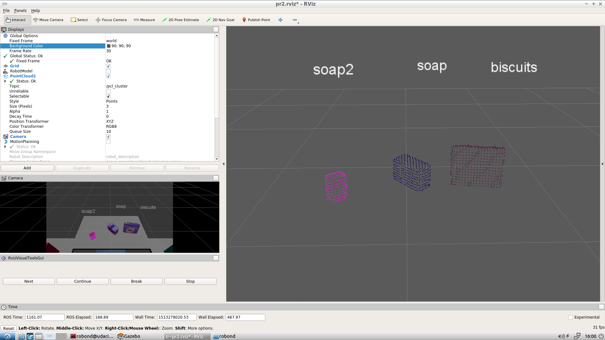

# Project: Perception Pick & Place

--------------------------------------------------------------------------------

# Required Steps for a Passing Submission:

1. Extract features and train an SVM model on new objects (see `pick_list_*.yaml` in `/pr2_robot/config/` for the list of models you'll be trying to identify).
2. Write a ROS node and subscribe to `/pr2/world/points` topic. This topic contains noisy point cloud data that you must work with.
3. Use filtering and RANSAC plane fitting to isolate the objects of interest from the rest of the scene.
4. Apply Euclidean clustering to create separate clusters for individual items.
5. Perform object recognition on these objects and assign them labels (markers in RViz).
6. Calculate the centroid (average in x, y and z) of the set of points belonging to that each object.
7. Create ROS messages containing the details of each object (name, pick_pose, etc.) and write these messages out to `.yaml` files, one for each of the 3 scenarios (`test1-3.world` in `/pr2_robot/worlds/`). [See the example `output.yaml` for details on what the output should look like.](https://github.com/udacity/RoboND-Perception-Project/blob/master/pr2_robot/config/output.yaml)
8. Submit a link to your GitHub repo for the project or the Python code for your perception pipeline and your output `.yaml` files (3 `.yaml` files, one for each test world). You must have correctly identified 100% of objects from `pick_list_1.yaml` for `test1.world`, 80% of items from `pick_list_2.yaml` for `test2.world` and 75% of items from `pick_list_3.yaml` in `test3.world`.
9. Congratulations! Your Done!

### Here I will consider the rubric points individually and describe how I addressed each point in my implementation.

--------------------------------------------------------------------------------

### Writeup


### Exercise 1, 2 and 3 pipeline implemented

##### 0\. Add statistical filter clean up the noisy point cloud data.

In order to achieve the cleaning of noisy data, a function was created that filters out statistical outliers.


From the premise:

>Assuming a Gaussian distribution, all points whose mean distances are outside an interval defined by global mean+standard deviation distances are considered outliers and removed from the point cloud.

Results by `k_neighbors=10, scale_f=0.05`:


#### 1\. Complete Exercise 1 steps. Pipeline for filtering and RANSAC plane fitting implemented.

Exercise 1 consisted of applying RANSAC to process the data from the point cloud and extract only the points that are part of the objects by adjusting the data to a flat model.  

The steps to complete this exercise are the following:

  1. Downsample your point cloud by applying a Voxel Grid Filter.
    - Leaf size of the voxel: **0.01**
  2. Apply a Pass Through Filter to isolate the table and objects.
    - Axis **z**, between: **0.57** and **1.1**
    - Axis **y**, between: **-046** and **0.46**
    - Axis **x**, between: **0.4** and **1**
  3. Perform RANSAC plane fitting to identify the table.
  4. Use the ExtractIndices Filter to create new point clouds containing the table and objects separately.


#### 2\. Complete Exercise 2 steps: Pipeline including clustering for segmentation implemented.

Work was done in Exercise 2 to separate the point clouds corresponding to each object and then assign them a color, obtaining the following results:

The steps to complete this exercise are the following:

  1. Apply Euclidean clustering on the table-top objects (after table segmentation is successful)
      * As the different size of the objects, there were also different size of clusters:
          - It was choose a tolerance of **0.05**.
          - Cluster size between **50** and **8000**
  2. Create a XYZRGB point cloud such that each cluster obtained from the previous step has its own unique color.
  3. Finally publish your colored cluster cloud on a separate topic clusters



#### 3\. Complete Exercise 3 Steps. Features extracted and SVM trained. Object recognition implemented.

Exercise 3 asked to classify the cluster for object recognition. To do that it was necessary to:

  1. Generate a training set by capturing features.
    * 500 samples per object
    * 32 bins in a range of 0 to 256 to calculate the color histograms.
    * 10 bins in a range of -1 to 1 to calculate the normal histograms.
  2. Train a support vector machine for classification.
    * After testing different configurations of the SVM it was opted for the linear kernel and C=1.2.


  3. Classify the clouds of segmented objects and publish label markers.


#### 4\. Calculate the centroid (average in x, y and z) of the set of points belonging to that each object. Then create a ROS messages containing the details of each object (name, pick_pose, etc.) and write these messages out to `.yaml` files, one for each of the 3 scenarios (`test1-3.world` in `/pr2_robot/worlds/`).

To calculate the centroid, we worked with the point clouds and the data type. Then for each cluster the mean of each axis was calculated to obtain the coordinates of the centroid.

Finally it was created the ROS messages required to write a `output_1-3.yaml` for each test scene. For each individual object it was written the follow information:

```yaml
object_list:
- test_scene_num: 1
  arm_name: left
  object_name: car
  pick_pose:
    position:
      x: 0
      y: 0
      z: 0
    orientation:
      x: 0
      y: 0
      z: 0
      w: 0
  place_pose:
    position:
      x: 0
      y: 0
      z: 0
    orientation:
      x: 0
      y: 0
      z: 0
      w: 0
```

## Conclusion

All the concepts and techniques acquired during exercises 1, 2 and 3 were applied successfully. A statistical filter was also applied to clean the intrusive data with acceptable results. Finally, all the necessary ROS messages were created to obtain the appropriate information to write the yaml files as requested.

The classification was relatively good, but he had problems with the book classifying it as sticky notes. That could be solved with a larger training set, working with the capture of features, p. change the histogram settings or adjust the SVM parameters.

As a curious note, when the voxel size is 0.005, the SVM usually confuses the glue with the cookies but correctly recognizes the book. In addition, the output was not stable, so a small logic was added to wait until 3 equal consecutive exits remain. As an example, with the previous configuration of the voxel grid filter, the SVM manages to correctly classify all the objects as shown in the following image and the `output_3_100.yaml`.


As future work, it is planned to face the challenge of choosing and placing.
