# Deep Learning Project

## Follow me

#### _Robotic Nanodegree Udacity_

---

Table of contents:

<!-- TOC depthFrom:2 depthTo:4 withLinks:1 updateOnSave:0 orderedList:0 -->

- [Follow me](#follow-me)
		- [_Robotic Nanodegree Udacity_](#robotic-nanodegree-udacity)
- [Introduction](#introduction)
- [FCN model](#fcn-model)
	- [Architecture](#architecture)
	- [Main Components](#main-components)
		- [Enconder](#enconder)
		- [Middle Layer - Convolution 1x1](#middle-layer-convolution-1x1)
		- [Decoder](#decoder)
	- [Implementation](#implementation)
		- [Hardware](#hardware)
		- [Code](#code)
		- [Hyper-parameters (template so it is need to review)](#hyper-parameters-template-so-it-is-need-to-review)
- [Results](#results)
	- [Patrol No Tarjets](#patrol-no-tarjets)
	- [Target from far away](#target-from-far-away)
	- [Following behind target](#following-behind-target)
	- [Scores](#scores)
- [Conclusion & Discusion](#conclusion-discusion)

<!-- /TOC -->

## Introduction
---
This project aims to apply all the concepts seen in class on deep learning, specifically related to semantic segmentation of images. For that here a type of *deep neural network* known as _fully convolutional network_ (FCN) was designed and trained using many techniques developed in recent years.

Semantic segmentation aims not only to detect a probability of class presence in an image, which is a common sorting task, but also to obtain information from the entire image image by assigning each pixel of the image a semantic class, understanding the image at pixel level in order to be able to say what there is and where it is in the image.

Here the FCN is used by a drone to identify and track a target in simulation. The so-called "follow me" applications like this are key in many fields of robotics and the same techniques you apply here could be extended to scenarios such as advanced cruise control in autonomous vehicles or man-robot collaboration in the industry. Other fields of application are medicine in the processing of medical images and satellite image monitoring.

Basically, the task of the FCN is to identify from the image which pixels are part of the target (a person dressed in red), which are part of the public's people and which are the background.

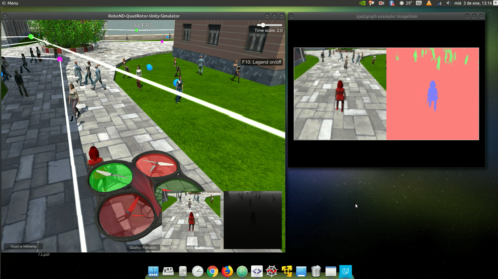

## FCN model

---

### Architecture

Mainly the architecture used for this project is an Encoder-Decoder model using fully convolutional network. The keys of this models are the fully connected layers are replaced with 1x1 convolutional layers, the skip connections and transpose convolution layers. Below there are introduced in more detail each of this components.

### Main Components

#### Enconder

The encoder block works as the features extractor, basically in the same way as traditional CNNs as going deeper more complex structures and shapes were abstracted from layer to layer. For example, the first layers will learn basic filters to extract lines or corners, but the ending layer might be able to learn as complex shapes as a face . The problem that present this block is that gradually it lose spacial information as deeper the layer is and semantic segmentation requires the exact alignment of class maps and thus, needs the ‘where’ information to be preserved. Solve that is the main objective of the decoder.

##### Separable convolutions

For the implementation of this model, there were introduced a new kind of convolutional layer which has the advantage of reduce the number of trainable parameters, improving the runtime performance, without loosing significantly learning capasity of the model. There are called separable (also known as depthwise) because it comprise of a convolution operation over each channel of the input followed by a 1x1 convolution and finally merge them into the output layer. This can be done because of the hypothesis that spatial and depthwise information can be decoupled.

##### Batch Normalization

An other technique used for the implementation of the model the batch normalization, by basically forcing each batch to be unit standard deviation and zero mean. This improves gradient flow, so the network train is faster. Actually introduce more mathematical operations makes slightly heavier each iteration but the overall results is a earlier convergence. In addition allows the use much higher learning rates, which further increases the speed at which networks train. Also works as a kind regularization making dropout less important.

#### Middle Layer - Convolution 1x1

The 1x1 convolution it came to replace the dense layers used for classification, because it has advantage of maintains the spatial information, something essential for semantic segmentation. Also, it can help reducing or increasing the dimensionality of the layer. Lastly but no minor,  replacing the fully connected layer with 1x1 convolution added advantage that during inference the input can be images of any size.

#### Decoder

Unlike classification where the end result of the very deep network is the only important thing, semantic segmentation not only requires discrimination at pixel level but also a mechanism to project the discriminative features learnt at different stages of the encoder onto the pixel space.

The decoder receive as input the result of the 1x1 convolution. The task of the decoder is to semantically project the extracted features (lower resolution) by the encoder onto the pixel space (higher resolution) to get a pixel wise classification. This block is composed by transposed convolution which essentially is the reverse operation of encoder layers by upsampling the image back to a higher dimension and then applying convolutional layers. The main operation used here is the bilinear upsampling is a resampling technique that utilizes the weighted average of four nearest known pixels, located diagonally to a given pixel, to estimate a new pixel intensity value.

##### Skip connection

The decoder as it was explained above has the problem that there is some information that it is lost during dimension augmentation. To recover part of this information the decoder use the output of layers from encoder. This process is known as skip connection and able the network can use information from multiple resolution scales, improving the precision of the segmentation.

### Implementation
---
Here it will describe in more detail the implementation of the model and the criteria used in design decisions. Most of the code is based on experience gained during the _segmentation lab_.

#### Hardware

The hardware used was a notebook equipped with an Intel Core i7-7700HQ processor, 8GB DDR4-2400Mhz RAM memory and an NVIDIA GeForce GTX 1060-3GB mobile GPU running on the Ubuntu 16.04LTS operating system.

#### Code

```python

def encoder_block(input_layer, filters, strides):
    # Feature maps generation
    output_layer = separable_conv2d_batchnorm(input_layer, filters, strides)
    return output_layer
```

The enconder block it is simply a la separable 2D convolution layer and ReLU activation with batch normalization before the output.

```python
def decoder_block(small_ip_layer, large_ip_layer, filters):
    # Up-sampling
    upsample_layer = bilinear_upsample(small_ip_layer)
    # Skip conection
    concated_layer = layers.concatenate([upsample_layer, large_ip_layer])
    # semantic maps generation
    conv_1 = separable_conv2d_batchnorm(concated_layer, filters)
    conv_2 = separable_conv2d_batchnorm(conv_1, filters)

    output_layer = conv_2
    return output_layer
```

The decoder block consists of the up sampling "layer", follow by a concatenation layer for the skip connection with higher resolution map. Finally, two 2D separable convolution layers for the generation of the semantic maps with spacial information. Two convolutional layers were placed under the hypothesis that the re-sampling is flawed and has to be merged with the information from the encoder layer, so at least two stages seems reasonable for generating the maps.

```python
def fcn_model(inputs, num_classes):
    # 160x160x3 -> 80x80x32
    encoder_1 = encoder_block(inputs,32,2)
    # 80x80x32 -> 40x40x64
    encoder_2 = encoder_block(encoder_1,64,2)
    # 40x40x64 -> 20x20x128
    encoder_3 = encoder_block(encoder_2,128,2)
    # Add 1x1 Convolution layer using conv2d_batchnorm().
    comprimed = conv2d_batchnorm(encoder_3,256,kernel_size=1,strides=1)
    # 20x20x256 -> 40x40x128
    decoder_1 = decoder_block(comprimed,encoder_2,128)
    # 40x40x128 -> 80x80x64
    decoder_2 = decoder_block(decoder_1,encoder_1,64)
    # 80x80x64 -> 160x160x32
    decoder_3 = decoder_block(decoder_2,inputs,32)
    # The function returns the output layer of your model.
    return layers.Conv2D(num_classes, 3,
                         activation='softmax',
                         padding='same')(decoder_3)
```
The complete FCN model consitst of:
  * Three sub-blocks for the encoder main block increasing the deepth with each layer by a factor of 2 as the the downsample caused by stride 2. Straid 2 it is needed because the padding is `same` and there is no pooling layers.
  * Middle layer is a unique 1x1 convolutional layer with stide 1, ReLu activation and batch normalization.
  * Also three sub-blocks for the decoder main block but now decreasing the deepth with each sub-block by a factor of 2 as the up-sampling. Every decoder sub-block it is connected with the encoder block with the same output shape.
  * The output layer is a 2D convolution with a 3x3 kernel, `same` padding to preserve the size and `softmax` activation due the 3 classes classify.

NOTE: The core size was chosen 3x3 because it gives better results than a 1x1 by a factor of 0.05 (5%) in the final score. However, it makes sense that a larger core can better associate the information from the last layer.

NOTE: Due to the batch normalization the not use of drop out it is compensated in some way.

NOTE: For the design it was kept in mind that the dataset provided is limited so there is more chance of overfitting.

##### Keras model diagram

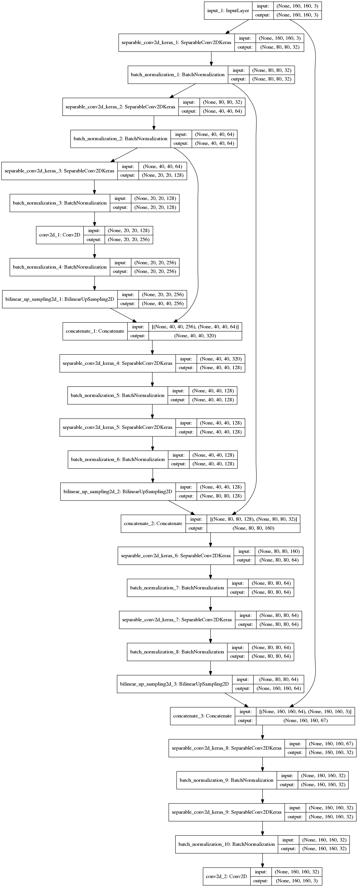

##### Model Summery
```
________________________________________________________________________________
Layer (type)                                     Output Shape            Param #
================================================================================
input_1 (InputLayer)                             (None, 160, 160, 3)           0
________________________________________________________________________________
separable_conv2d_keras_1 (SeparableConv2DKeras)  (None, 80, 80, 32)          155
________________________________________________________________________________
batch_normalization_1 (BatchNormalization)       (None, 80, 80, 32)          128
________________________________________________________________________________
separable_conv2d_keras_2 (SeparableConv2DKeras)  (None, 40, 40, 64)         2400
________________________________________________________________________________
batch_normalization_2 (BatchNormalization)       (None, 40, 40, 64)          256
________________________________________________________________________________
separable_conv2d_keras_3 (SeparableConv2DKeras)  (None, 20, 20, 128)        8896
________________________________________________________________________________
batch_normalization_3 (BatchNormalization)       (None, 20, 20, 128)         512
________________________________________________________________________________
conv2d_1 (Conv2D)                                (None, 20, 20, 256)       33024
________________________________________________________________________________
batch_normalization_4 (BatchNormalization)       (None, 20, 20, 256)        1024
________________________________________________________________________________
bilinear_up_sampling2d_1 (BilinearUpSampling2D)  (None, 40, 40, 256)           0
________________________________________________________________________________
concatenate_1 (Concatenate)                      (None, 40, 40, 320)           0
________________________________________________________________________________
separable_conv2d_keras_4 (SeparableConv2DKeras)  (None, 40, 40, 128)       43968
________________________________________________________________________________
batch_normalization_5 (BatchNormalization)       (None, 40, 40, 128)         512
________________________________________________________________________________
separable_conv2d_keras_5 (SeparableConv2DKeras)  (None, 40, 40, 128)       17664
________________________________________________________________________________
batch_normalization_6 (BatchNormalization)       (None, 40, 40, 128)         512
________________________________________________________________________________
bilinear_up_sampling2d_2 (BilinearUpSampling2D)  (None, 80, 80, 128)           0
________________________________________________________________________________
concatenate_2 (Concatenate)                      (None, 80, 80, 160)           0
________________________________________________________________________________
separable_conv2d_keras_6 (SeparableConv2DKeras)  (None, 80, 80, 64)        11744
________________________________________________________________________________
batch_normalization_7 (BatchNormalization)       (None, 80, 80, 64)          256
________________________________________________________________________________
separable_conv2d_keras_7 (SeparableConv2DKeras)  (None, 80, 80, 64)         4736
________________________________________________________________________________
batch_normalization_8 (BatchNormalization)       (None, 80, 80, 64)          256
________________________________________________________________________________
bilinear_up_sampling2d_3 (BilinearUpSampling2D)  (None, 160, 160, 64)          0
________________________________________________________________________________
concatenate_3 (Concatenate)                      (None, 160, 160, 67)          0
________________________________________________________________________________
separable_conv2d_keras_8 (SeparableConv2DKeras)  (None, 160, 160, 32)       2779
________________________________________________________________________________
batch_normalization_9 (BatchNormalization)       (None, 160, 160, 32)        128
________________________________________________________________________________
separable_conv2d_keras_9 (SeparableConv2DKeras)  (None, 160, 160, 32)       1344
________________________________________________________________________________
batch_normalization_10 (BatchNormalization)      (None, 160, 160, 32)        128
________________________________________________________________________________
conv2d_2 (Conv2D)                                (None, 160, 160, 3)         867
================================================================================
Total params: 131,289
Trainable params: 129,433
Non-trainable params: 1,856
```

#### Hyper-parameters (template so it is need to review)

The hyper parameters were basically configured by trial and error, but some thumb rules were taken into account.

##### Learning rate

Learning rate is a step size of how quickly find optimal weights. Here, as the gradient descent optimization algorithm is 'Adam' (Adaptive Moment Estimation) the real parameter that it is being tunning is 'Alpha' but it works as the learning rate. Adam is in deed an adaptive learning-method algorithm, and give the advantage that you do not need to pay much attention to the learning rate. It was chosen 0.005 (A little bigger than the authors recommendation of 0.001) trying to accelerate a bit the training and hopping that the adaptive part of Adam do his part.

##### Batch size

Use all the training set to calculate the loss, it cost a considerable amount of memory  (most of the time ridiculously expensive) and also a heavy computing task. But if  done in small portions or batches, it leads to similar results, while a faster computing and with less memory price. In deed, the memory use to be the limitation that set the batch size. On my case, choosing a batch size of 30 sometime throw a memory error, so reducing a bit the size to 25, I was sure the training would finish.

##### Epochs
An epoch is a single forward and backward pass of the whole dataset. If the number of epoch is too high, the networks get overfitting and if low, the networks is under-trained.

  * **steps_per_epoch:**  is the number of the training lot at one time. I configure it depending on the lot size. As the bath size was 25 and represented less than 0.7% of the training data set, I decided to adjust this parameter too much and set it at 500 . Also as it is small it also introduces noise into the gradient descent so I expected many steps work as a smoothing filter.

  * **validation_steps:** same as steps_per_epoch for validation set. The validation is for checking hyper-parameters. As many step the validation does slower the training. I decided to stay default to not let the training get so lazy, but with the risk of a worse representation of the dataset.

## Results

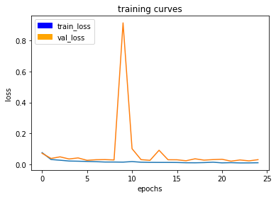

NOTE: the high pick show what could happen with small step.

**The last epoch's loss:**
`500/500 [==============================] - 224s - loss: 0.0111 - val_loss: 0.0309`


### Patrol No Tarjets

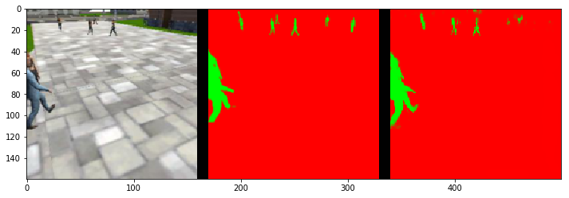
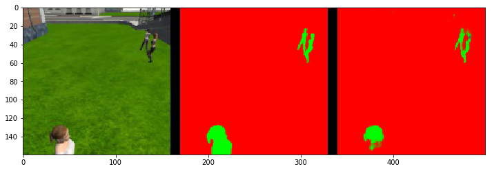
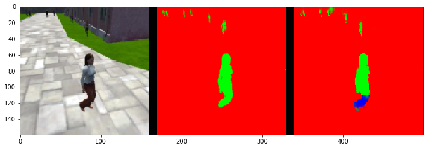

```
number of validation samples intersection over the union evaulated on 270
average intersection over union for background is 0.9841679485909834
average intersection over union for other people is 0.7576500180197785
average intersection over union for the hero is 0.0
number true positives: 0, number false positives: 84, number false negatives: 0
```
### Target from far away

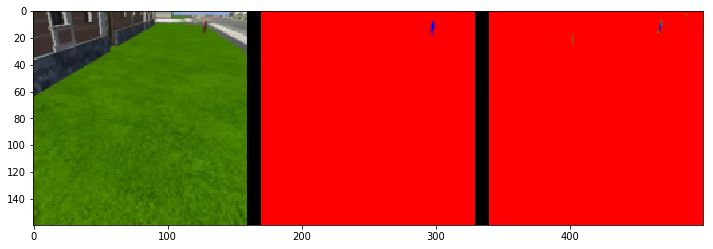
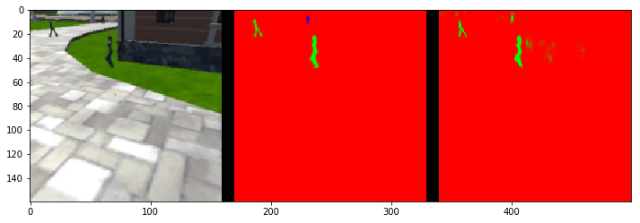
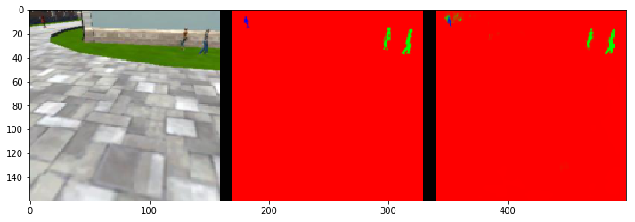

```
number of validation samples intersection over the union evaulated on 322
average intersection over union for background is 0.9957336587844186
average intersection over union for other people is 0.4269876599124866
average intersection over union for the hero is 0.2814750182809856
number true positives: 162, number false positives: 2, number false negatives: 139
```
### Following behind target

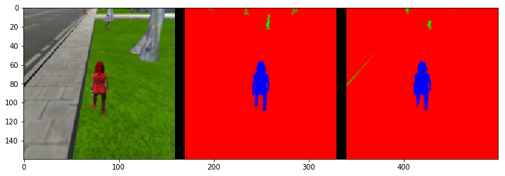
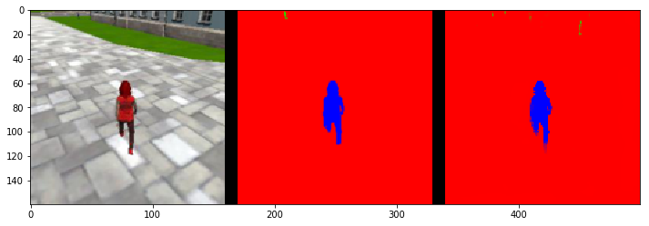
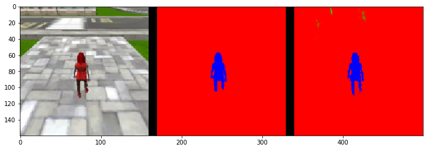

```
number of validation samples intersection over the union evaulated on 542
average intersection over union for background is 0.9952978748610927
average intersection over union for other people is 0.35322494350721856
average intersection over union for the hero is 0.9080719997820011
number true positives: 539, number false positives: 0, number false negatives: 0
```

### Scores

* **Weight:** 0.7570194384449244
* **Final IoU:** 0.594773509031
* **FINAL SCORE:** 0.450255107809

The FCN model get a Final score over the 0.40 required, trained only with the data included. During simulation the drone is able to follow the target aparentely without any problem as it show [this video](https://youtu.be/cvx2IqAUTyg).

## Conclusion & Discusion

A convolutional network model has been successfully carried out to identify and track a target in the simulation. Although I had some previous knowledge about Deep Learning and CNN, I have learn a lot about deep learning, specifically about semantic segmentation that I had only the idea.

About results obtained, I was a bit surprised with the performance of the model and how well it work in the simulation. I thought that  the data would not be enough for the model to learn because there are not a big amount. It is clear that if I worked to obtain more data, the model would achieve a better generalization of the problem and therefore better results. Also the model is quite simple, and with more data the increase the number of layers will not carry over fitting problems so easy.

In addition, I think the model can easily identify the target as it is monochromatic red, clearly a big feature easy to learn, so if the target is changed I do not think the the model work very well. Even more difficult if the target is something else like a dog or a car. I good approach for that could be transfer learning for the encoding block of the model, using a pre-trained weights of a CNN model and then train the new model so the decoding block can learn. it is worth mentioning that a accurate dataset with a proper ground truth is compulsory

Working with my own GPU it was a good experience, especially deal with the lack of memory.
