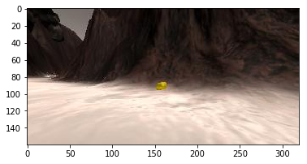
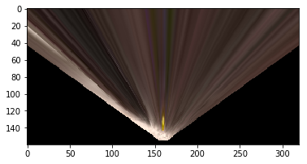
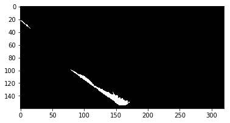
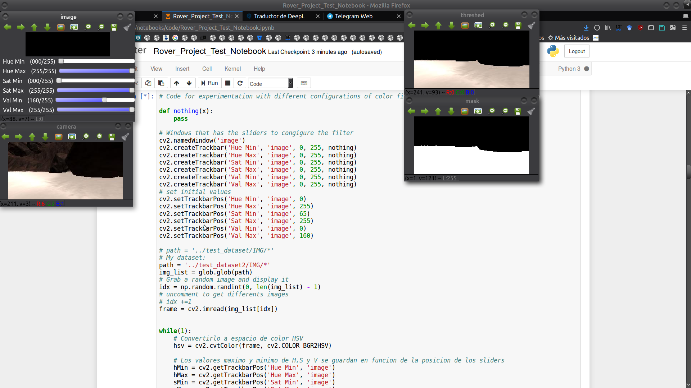
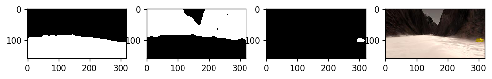
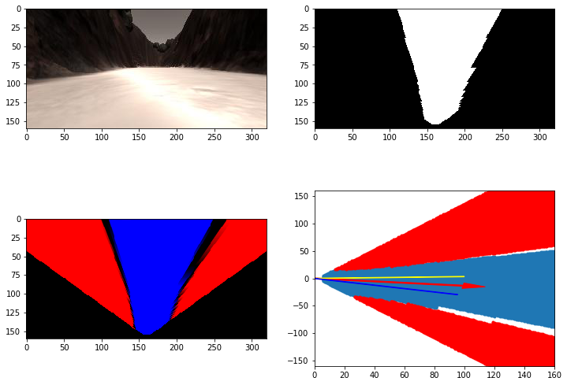
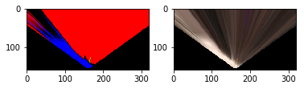
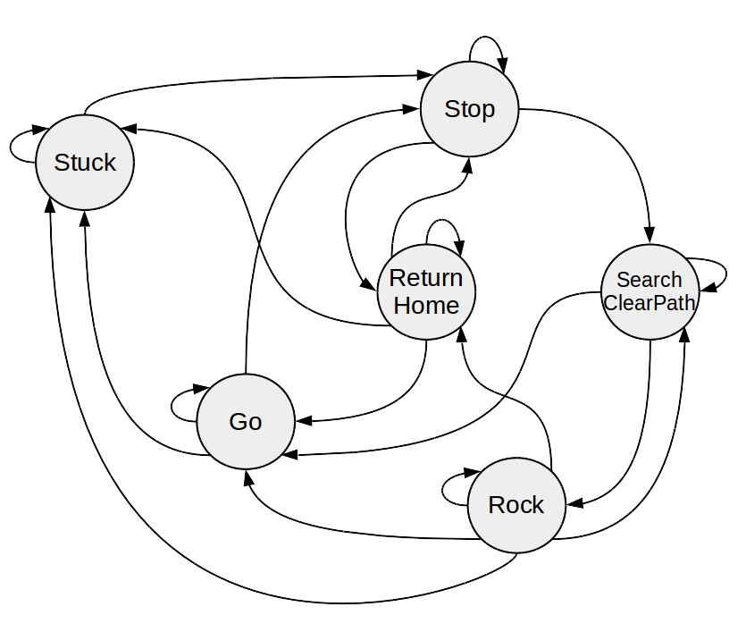
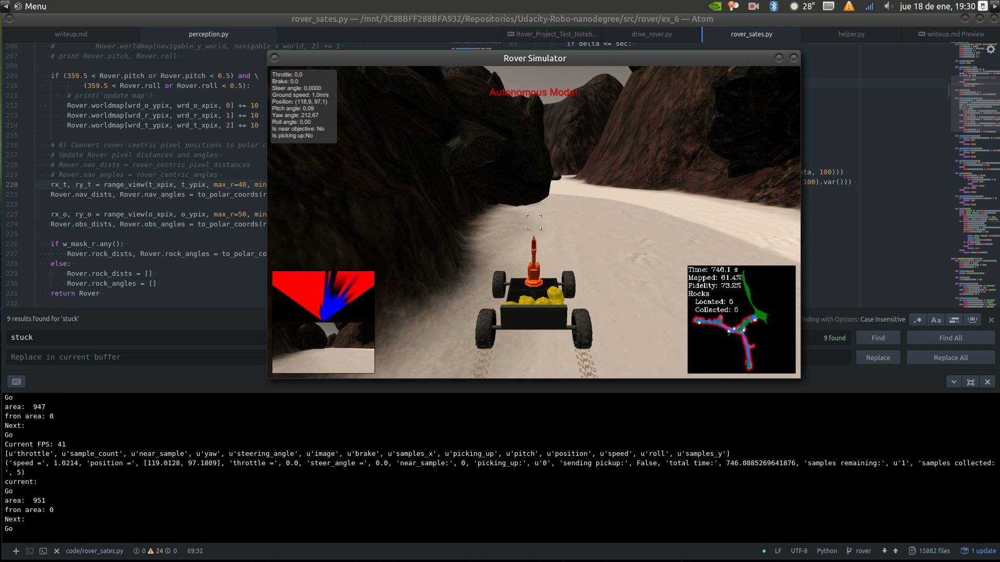

## Project: Search and Sample Return

### Writeup / README

### Notebook Analysis
#### 1. Run the functions provided in the notebook on test images (first with the test data provided, next on data you have recorded). Add/modify functions to allow for color selection of obstacles and rock samples.

After running the provided functions on the provided data, they were run on  my own data recorded from the simulation `path = '../test_dataset2/IMG/*'`



#### Perspect transform

After defining the source and destination points in the image space need it for the perspective transform and define the function as in the respective lesson.

Example of the output of the perspective transform on the previous image.



#### Color thresholding

For the color thresholding first it was defined a function in the RGB space, as in the respective lessons:

```python
# Threshold of RGB > 160 does a nice job of identifying ground pixels only
def color_thresh(img, rgb_thresh=(160, 160, 160)):
# Create an array of zeros same xy size as img, but single channel
color_select = np.zeros_like(img[:,:,0])
# Require that each pixel be above all three threshold values in RGB
# above_thresh will now contain a boolean array with "True"
# where threshold was met
above_thresh = (img[:,:,0] > rgb_thresh[0]) \
            & (img[:,:,1] > rgb_thresh[1]) \
            & (img[:,:,2] > rgb_thresh[2])
# Index the array of zeros with the boolean array and set to 1
color_select[above_thresh] = 1
# Return the binary image
return color_select
```

As an example, the application of thresholding filter on the previous image after the perspective transformation for the navigable terrain. The function output a binary mask with 1 for the pixels corresponding to the navigable terrain.



Going a bit furhter it was implemented some code for experimentation with different configurations of color filters working in the HSV color space:

```python

# Code for experimentation with different configurations of color filters working in the HSV color space.

def nothing(x):
    pass

# Windows that has the sliders to congigure the filter
cv2.namedWindow('image')
cv2.createTrackbar('Hue Min', 'image', 0, 255, nothing)
cv2.createTrackbar('Hue Max', 'image', 0, 255, nothing)
cv2.createTrackbar('Sat Min', 'image', 0, 255, nothing)
cv2.createTrackbar('Sat Max', 'image', 0, 255, nothing)
cv2.createTrackbar('Val Min', 'image', 0, 255, nothing)
cv2.createTrackbar('Val Max', 'image', 0, 255, nothing)
# set initial values
cv2.setTrackbarPos('Hue Min', 'image', 0)
cv2.setTrackbarPos('Hue Max', 'image', 255)
cv2.setTrackbarPos('Sat Min', 'image', 65)
cv2.setTrackbarPos('Sat Max', 'image', 255)
cv2.setTrackbarPos('Val Min', 'image', 0)
cv2.setTrackbarPos('Val Max', 'image', 160)

# path = '../test_dataset/IMG/*'
# My dataset:
path = '../test_dataset2/IMG/*'
img_list = glob.glob(path)
# Grab a random image and display it
idx = np.random.randint(0, len(img_list) - 1)
# uncomment to get differents images
# idx +=1
frame = cv2.imread(img_list[idx])


while(1):
    # Convertirlo a espacio de color HSV
    hsv = cv2.cvtColor(frame, cv2.COLOR_BGR2HSV)

    # Los valores maximo y minimo de H,S y V se guardan en funcion de la posicion de los sliders
    hMin = cv2.getTrackbarPos('Hue Min', 'image')
    hMax = cv2.getTrackbarPos('Hue Max', 'image')
    sMin = cv2.getTrackbarPos('Sat Min', 'image')
    sMax = cv2.getTrackbarPos('Sat Max', 'image')
    vMin = cv2.getTrackbarPos('Val Min', 'image')
    vMax = cv2.getTrackbarPos('Val Max', 'image')

    # Se crea un array con las posiciones minimas y maximas
    lower = np.array([hMin, sMin, vMin])
    upper = np.array([hMax, sMax, vMax])

    # Deteccion de colores
    mask = cv2.inRange(hsv, lower, upper)
#     roi = np.zeros_like(mask)
    roi = np.zeros((image.shape[0], image.shape[1]), dtype=np.uint8)
    roi[70:, :] = 1

    mask_roi = mask * roi
    threshed = cv2.bitwise_and(frame, frame, dst=None, mask=mask_roi)

    # Mostrar los resultados y salir
    cv2.imshow('camara', frame)
    cv2.imshow('thresed', threshed)
    cv2.imshow('mask', mask)
    k = cv2.waitKey(5) & 0xFF
    if k == 27:
        break
    elif k == 97:
        idx = np.random.randint(0, len(img_list) - 1)
        frame = cv2.imread(img_list[idx])

cv2.destroyAllWindows()
```


After a while of experimentation, it was implemented a function that its outputs three masks, one for navigable terrain, one for obstacles and one for golden rocks.

```python
def color_thresh_hsv(img, low_thresh=(20, 85, 85), high_thresh=(35, 255, 255), inv=False, roi=None):.
    img_hsv = cv2.cvtColor(img, cv2.COLOR_RGB2HSV)
    mask = cv2.inRange(img_hsv, low_thresh, high_thresh, dst=None) / 255
    if roi is not None:
        mask = roi * mask
    if inv is True:
        mask = -(mask - 1)
    mask = cv2.blur(mask, (7, 7))
    res = cv2.bitwise_and(img, img, dst=None, mask=mask)
    return res, mask


def world_segmentation(img,
                       l_r_thresh=(20, 65, 65),
                       h_r_thresh=(35, 255, 255),
                       l_n_thresh=(0, 0, 160),
                       h_n_thresh=(255, 120, 255),
                       roi=None,
                       l_o_thresh=(0, 40, 0),
                       h_o_thresh=(255, 255, 120)):
    res, mask_r = color_thresh_hsv(img, l_r_thresh, h_r_thresh)
    res, mask_n = color_thresh_hsv(img, l_n_thresh, h_n_thresh, roi=roi)
    res, mask_o = color_thresh_hsv(img, l_o_thresh, h_o_thresh)
    return mask_n, mask_o, mask_r
```

Additionally, it was declared a region of interest (roi) as a binary mask  to the thresholding of the navigable terrain to avoid the sky that sometimes introduce some noise. This mask is used for the the `cv2.bitwise_and()`.

The example below shows the result:



####  Coordinate Transformations

Finally, it was done several test an experimentations with some function thought for the future navigation.

The results shows at the bottom left image the colored wrapped images that then is used as output (red: obstacle, blue: navigable, green: rock)

At the bottom right image, it show the pixel values in rover-centric coords and distance/angle. Also there are three lines, the red arrow is the mean of the angles of the navigable terrain and the yellow and blue lines are the mean plus the standard deviation (+/-) that then it was used as base variable offset for the rover steer.



Another example with a rock:



#### 1. Populate the `process_image()` function with the appropriate analysis steps to map pixels identifying navigable terrain, obstacles and rock samples into a worldmap.  Run `process_image()` on your test data using the `moviepy` functions provided to create video output of your result.

The `process_image()` function was populated by chaining together the world segmentation, the perspective transform and the coordinates transform to rover-centric coords. Finally, the rover-centric coords were transform to world coords to update the worldmap. The results are shown at the video of recorded images that were processed by this function. Please see output/test_mapping_mine.mp4 for the video.

### Autonomous Navigation and Mapping

##### Perception

The `perception_step()` is almost the same chain of functions used in `process_image()` avobe but with some modifications. The first one is that the worldmap map is only update when the rover's pitch and roll were around 0 +/- 0.5 º to reduce perspective erros.
```python
if (359.5 < Rover.pitch or Rover.pitch < 0.5) and \
        (359.5 < Rover.roll or Rover.roll < 0.5):
    # print('update map')
    Rover.worldmap[wrd_o_ypix, wrd_o_xpix, 0] += 10
    Rover.worldmap[wrd_r_ypix, wrd_r_xpix, 1] += 10
    Rover.worldmap[wrd_t_ypix, wrd_t_xpix, 2] += 10
```

The other important change was the limitation of the range of view for the update of the worldmap. This functions was used also for the update of the worldmap to use the pixels correspondig to a range of view less than 50. Also it was used to update the `Rover.nav_*` and `Rover.obj_` data before transforming to polar coods.

```python
def range_view(xpix, ypix, max_r=50, min_r=0):
    dist = np.sqrt(xpix**2 + ypix**2)
    rxpix = xpix[(min_r <= dist) & (dist <= max_r)]
    rypix = ypix[(min_r <= dist) & (dist <= max_r)]
    return rxpix, rypix
```

##### Decision

For the `decision_step()` it was implemented a state machine with five state: `Go`, `Stuck`, `Stop`, `SearchClearPath`, `Rock` and `ReturnHome`.



Each state is declared as Python class. The code is of the states is on `./code/rover_sate.py` and some auxiliar functions are in `./code/helper.py`

The main ideas for each state are explained below:

###### Go

This is the main state during mapping when the rover advances. Using the `Rover. nav_angles` determines when to switch to the `Stop` state or stay in `Go` state by calculating the navigable area. The address is updated using the mean and standard deviation of the same data, focusing on following the left wall. To better understand the distribution of the navigable zone in front of the Rover, fractions are calculated on both sides (left/right) helping to decide when it is safe to turn left or right or straight ahead.

When navigable terrain is not sufficient or there is a rock in sight, the rover changes to `Stop`. If the rover has a positive acceleration value but the speed is close to zero, the rover changes to the `Stuck` state.


###### Stop

The Rover maintains this state until braking is complete. Also wait a little while for the rover to stabilize because pitching tends to be considerable. If the state was triggered by rock detection, the next state is "Rock". For any other reason the next state will be `SearchClearPath` but with the exception of `Return Home` when all the rocks were collected.

###### Stuck

When the Rover accelerate but it is not moveing it get to `Stuck` state. This state only try to unstack the rover by going backwards for a while and then change to `Stop` state.

###### SearchClearPath

This state has the task of turn the rover over itself until there is enough navigable terrain after the `Stop` state. By default it turns right but if it came from the `Rock` sate the turn direction could change deppending the las turn done to reach the rock.

###### Rock

The task here is to get close enough to the rock to pick it up. It uses the polar coordinate data calculated in the perception step that corresponds to a stone after segmentation. The rover direction is updated when the rock is outside an arc of 25º. the maximum speed is set to 0.5 because it is easy to lose sight of the rock when it's far away. When the rock is close enough, the Rover performs the pickup. If the rock is lost several times the state is ignored.

###### ReturnHome

It was thought that this state would return home when there is no more rock to find, but it could never be tested properly, especially since the rover tends to get stuck.

#### 2. Launching in autonomous mode your rover can navigate and map autonomously.  Explain your results and how you might improve them in your writeup.

For the test shown [here](https://youtu.be/yd5RHocJ9gE) the simulation resolution was 1024x60 wiht `Good` graphics Quality. At the minute 05:38 are passed the 40% of mapping with more than 70% of accuracy.

Here I'll talk about the approach I took, what techniques I used, what worked and why, where the pipeline might fail and how I might improve it if I were going to pursue this project further.

##### Notes:

* The maximum rover speed was set to 1 because the movements tend to be very thick. At first I thought about using a variable throttle, but if I used a value less than 0.1, the behavior of the rover was strange.

* I had a lot of problems with the spherical obstacles, because there is a lot of navigable terrain underneath them but the rover got stuck with its tops. Much more work is needed on obstacle detection.

* The disengagement policy is very simple and often not enough to disengage the robot.

* The ReturnHome status is not finished due to lack of time but the main idea is coded.

* There are as many improvements that can be implemented as avoiding visiting the same place more than once or a smarter criterion for recognizing obstacles and what to do. I think the main state machine might be more efficient.

* The idea of the state machine and some other things were inspired after watching the video of the walk. However, the minimum requirement could be achieved by simply working with the perception step function.

* I need to comment that here I have implemented my first state machine and even that it doesn't work as I would like, I have spent many hours on this project. I think I was a little ambitious to make it perfect and I wasted a lot of time on not very important details like the color filter for segmentation. Anyway I have learned a lot and everything helps me as an experience.


